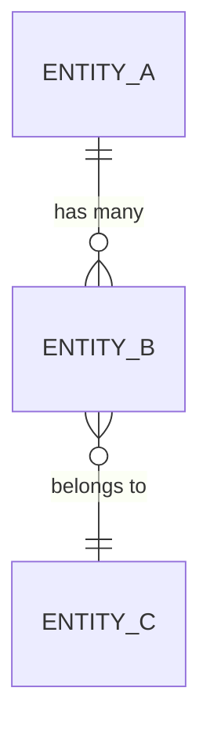
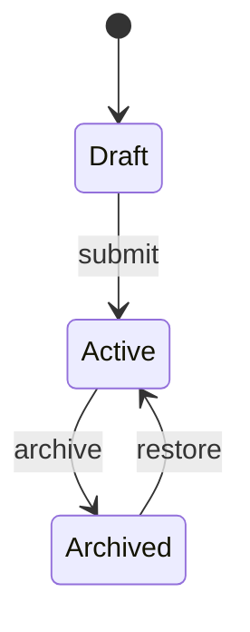

# PROJECT-SPEC.md — CodeBakers Specification Template

> This is the master template for generating production-ready application specifications. Claude Code fills in each Gate using patterns from activated agents. The final output is a `.zip` deliverable.

---

## Output Format

The completed spec is packaged as a `.zip` file with this structure:

```
<project-name>/
├── PROJECT-SPEC.md          ← This file, filled in
├── system/
│   ├── ROUTER.md             ← Agent routing rules
│   ├── CONVENTIONS.md        ← Code standards
│   ├── AGENT-TEMPLATE.md     ← For extending the system
│   ├── DESIGN-TOKENS.md      ← Token system + themes
│   └── MANIFEST.md           ← Agent registry
├── agents/                   ← Only activated agents included
│   ├── foundation/
│   ├── features/
│   ├── ui/
│   ├── integrations/
│   └── industries/
└── templates/
    └── code/                 ← Only relevant code templates included
```

---

## Gate 0 — Identity

| Field | Value |
|-------|-------|
| **Project Name** | _`<project-name>`_ |
| **Tagline** | _One-line description_ |
| **Elevator Pitch** | _2-3 sentences explaining the product, who it's for, and why it matters_ |
| **Design Theme** | _`tokens-<theme>.css` (see DESIGN-TOKENS.md selection rules)_ |
| **Key Differentiators** | _3-5 bullet points on what makes this product unique_ |

### Target Users

| Persona | Role | Goals | Pain Points |
|---------|------|-------|-------------|
| | | | |
| | | | |
| | | | |

### Activated Agents

| # | Agent | Path | Justification |
|---|-------|------|---------------|
| 1 | | | |
| 2 | | | |
| 3 | | | |
| _..._ | | | |

---

## Gate 1 — Entities

### ERD Diagram



### Entity Definitions

#### `<entity_name>`

_Purpose: What this entity represents._

| Column | Type | Constraints | Description |
|--------|------|-------------|-------------|
| `id` | `UUID` | PK, DEFAULT `gen_random_uuid()` | Unique identifier |
| | | | |
| `created_at` | `TIMESTAMPTZ` | DEFAULT `now()` | Creation timestamp |
| `updated_at` | `TIMESTAMPTZ` | DEFAULT `now()` | Last update timestamp |

**Indexes:**

| Index Name | Column(s) | Type | Purpose |
|-----------|-----------|------|---------|
| | | | |

**RLS Policies:**

| Policy Name | Operation | Using/Check Expression | Purpose |
|------------|-----------|----------------------|---------|
| | | | |

**Seed Data:**

```sql
INSERT INTO <entity_name> (column1, column2) VALUES
  ('value1', 'value2'),
  ('value3', 'value4');
```

_(Repeat entity definition block for each entity)_

---

## Gate 2 — State Changes

### Entity Lifecycle State Machines

#### `<entity_name>` States



| From State | To State | Trigger | Side Effects |
|-----------|----------|---------|-------------|
| | | | |

### Business Rules

| # | Rule Name | Entity | Condition | Action | Error Message |
|---|-----------|--------|-----------|--------|---------------|
| 1 | | | | | |
| 2 | | | | | |

### Automated Workflows

| # | Workflow Name | Trigger Event | Steps | Failure Handling |
|---|-------------|---------------|-------|-----------------|
| 1 | | | | |
| 2 | | | | |

### Validation Rules

| Entity | Field | Rule | Error Message |
|--------|-------|------|---------------|
| | | | |

---

## Gate 3 — Permissions

### Roles

| Role | Description | Default Access Level |
|------|-------------|---------------------|
| `super_admin` | System administrator | Full access |
| `admin` | Organization admin | Org-wide access |
| `member` | Standard user | Own data + shared |
| `viewer` | Read-only user | View only |
| `public` | Unauthenticated | Public routes only |

### Permission Matrix

| Resource | super_admin | admin | member | viewer | public |
|----------|:-----------:|:-----:|:------:|:------:|:------:|
| _entity_ | CRUD | CRUD | CRU(own) | R(own) | — |
| | | | | | |

### Access Control Implementation

```typescript
// middleware.ts — Role-based route protection
const rolePermissions: Record<Role, string[]> = {
  super_admin: ['*'],
  admin: ['/dashboard', '/settings', '/users', '/reports'],
  member: ['/dashboard', '/profile', '/tasks'],
  viewer: ['/dashboard', '/reports'],
  public: ['/login', '/register', '/'],
};
```

### Data Isolation Rules

| Rule | Implementation | Entities Affected |
|------|---------------|-------------------|
| Tenant isolation | RLS: `org_id = auth.jwt()->>'org_id'` | All org-scoped |
| User privacy | RLS: `user_id = auth.uid()` | Profile, settings |
| Shared resources | RLS: `is_public = true OR user_id = auth.uid()` | Documents, reports |

---

## Gate 4 — Dependencies & Automation

### Technology Stack

| Layer | Technology | Version | Purpose |
|-------|-----------|---------|---------|
| Framework | Next.js | 14.x | App router, SSR, API routes |
| Database | Supabase (PostgreSQL) | Latest | Data, auth, storage, realtime |
| ORM | Drizzle | Latest | Type-safe queries |
| Styling | Tailwind CSS | 3.x | Utility-first CSS |
| Validation | Zod | Latest | Schema validation |
| State | Zustand | Latest | Client state management |
| Testing | Vitest + Playwright | Latest | Unit + E2E tests |
| Deployment | Vercel | Latest | Hosting, edge functions |
| _...add more_ | | | |

### Environment Variables

| Variable | Required | Source | Description |
|----------|----------|--------|-------------|
| `NEXT_PUBLIC_SUPABASE_URL` | Yes | Supabase | Project URL |
| `NEXT_PUBLIC_SUPABASE_ANON_KEY` | Yes | Supabase | Anonymous key |
| `SUPABASE_SERVICE_ROLE_KEY` | Yes | Supabase | Server-side key |
| | | | |

### External Services

| Service | Purpose | Pricing Tier | Required |
|---------|---------|-------------|----------|
| Supabase | Database + Auth | Free / Pro | Yes |
| Vercel | Hosting | Free / Pro | Yes |
| | | | |

### Cron Jobs

| Job Name | Schedule | Endpoint/Function | Purpose | Timeout |
|----------|----------|-------------------|---------|---------|
| | | | | |

---

## Gate 5 — Integrations

### API Endpoints

| Method | Route | Purpose | Auth | Rate Limit | Request Body | Response |
|--------|-------|---------|------|------------|-------------|----------|
| GET | `/api/<resource>` | List | JWT | 60/min | — | `{ data: T[], count }` |
| POST | `/api/<resource>` | Create | JWT | 30/min | `CreateDTO` | `{ data: T }` |
| PATCH | `/api/<resource>/[id]` | Update | JWT | 30/min | `UpdateDTO` | `{ data: T }` |
| DELETE | `/api/<resource>/[id]` | Delete | JWT | 10/min | — | `{ success: true }` |
| | | | | | | |

### Webhook Endpoints

| Endpoint | Source | Events | Verification | Handler |
|----------|--------|--------|-------------|---------|
| `/api/webhooks/<service>` | | | | |

### Third-Party Integrations

| Service | Integration Type | Agent | Code Template | Purpose |
|---------|-----------------|-------|---------------|---------|
| | | | | |

### Email Templates

| Template | Trigger | Subject | Variables |
|----------|---------|---------|-----------|
| Welcome | User signup | `Welcome to <app>` | `{name, app_name}` |
| Reset Password | Password reset | `Reset your password` | `{name, reset_link}` |
| | | | |

---

## Implementation Plan

### Phase 1 — Foundation (Week 1)

- [ ] Project scaffolding (Next.js + Supabase + Tailwind)
- [ ] Design tokens applied (`tokens-<theme>.css`)
- [ ] Database schema migration (all Gate 1 entities)
- [ ] Authentication flow (signup, login, password reset)
- [ ] Role-based middleware
- [ ] RLS policies deployed

### Phase 2 — Core Features (Week 2)

- [ ] CRUD for all primary entities
- [ ] State machine transitions (Gate 2 workflows)
- [ ] Business rule enforcement
- [ ] Search and filtering
- [ ] File upload (if applicable)

### Phase 3 — Integrations & Polish (Week 3)

- [ ] Third-party integrations connected
- [ ] Webhook handlers deployed
- [ ] Email templates configured
- [ ] Cron jobs scheduled
- [ ] Notifications system live

### Phase 4 — Launch Readiness (Week 4)

- [ ] E2E test suite passing
- [ ] Lighthouse audit >90 all categories
- [ ] WCAG AA accessibility audit
- [ ] SEO meta tags + sitemap
- [ ] Error pages (400, 403, 404, 500)
- [ ] Monitoring + alerting configured
- [ ] Data export functionality
- [ ] User onboarding flow
- [ ] Production environment deployed

---

## Non-Functional Requirements

### Performance
- Lighthouse score >90 on all categories (Performance, Accessibility, Best Practices, SEO)
- First Contentful Paint <1.5s
- Time to Interactive <3.5s
- Core Web Vitals passing (LCP <2.5s, FID <100ms, CLS <0.1)

### Security
- OWASP Top 10 mitigations
- CSRF protection on all mutations
- Content Security Policy headers
- Rate limiting on all public endpoints
- Input sanitization on all user inputs
- SQL injection prevention via parameterized queries
- XSS prevention via output encoding

### Accessibility
- WCAG 2.1 AA compliance
- Keyboard navigation for all interactive elements
- Screen reader support with ARIA labels
- Color contrast ratio ≥4.5:1 for text
- Focus indicators on all focusable elements

### SEO
- Meta tags (title, description, og:image) on all pages
- Structured data (JSON-LD) where applicable
- Sitemap.xml generated
- Robots.txt configured
- Canonical URLs set

### Error Handling
- Custom error pages: 400, 403, 404, 500
- Global error boundary in React
- Toast notifications for user-facing errors
- Structured error logging (service, severity, context)

### Mobile-First
- Responsive design from 320px to 2560px
- Touch-friendly tap targets (≥44px)
- Bottom navigation for primary mobile actions
- Swipe gestures where appropriate

### Data Export
- CSV export for all list views
- PDF export for reports/invoices
- JSON API for programmatic access

### Monitoring
- Error tracking (Sentry or equivalent)
- Uptime monitoring
- Database performance monitoring
- API response time tracking

---

## Appendix: Agent Contributions Matrix

_Maps each activated agent to the Gates and sections it contributed to._

| Agent | Gate 0 | Gate 1 | Gate 2 | Gate 3 | Gate 4 | Gate 5 |
|-------|:------:|:------:|:------:|:------:|:------:|:------:|
| | | | | | | |
| | | | | | | |

_Key: ● = primary contributor, ○ = secondary contributor_
